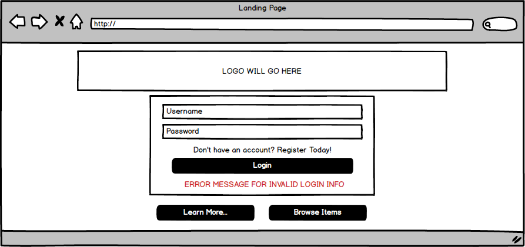

# MaskOFF
MaskOFF is a web application designed to trade your most sought after items. Have a pair of Yeezies or a Supreme Box Logo that doesn't fit you? Well... see what other users are looking for, if someone has the size you are looking for, then you can trade. We will be the middle man, and connect you with someone else that has what you need. From there, you will get in contact with them and set up your trade.

### LIVE

### USER STORIES
**Definitions**
1. Guest: A user that is not signed into the platform.
2. Member: A user that is signed into the platform.
3. System: The set of business logic that defines the platform.

**Stories**
1. As a **GUEST**, I can learn more about the application by going to "Learn More".
2. As a **GUEST**, I can browse the application and see other members listings.
    * Can use filters to narrow down their search for a specific item
    * Filter Categories
        * Brand
        * Size
        * Type (clothing, sneaker, accessory)
3. As a **GUEST**, I can register an account.
    * Username
    * Password
    * Gender
    * Age
    * Location
    * Email
4. As a **USER**, once I find an item I am interested in, I can immediately message the other user.
5. As a **USER**, once I accept a listing, it is saved to both profiles.
6. As the **SYSTEM**, I will render error messages.
7. As the **SYSTEM**, I will render contact information once a listing is accepted.
8. As the **SYSTEM**, I can remove profiles and listings.
9. As the **SYSTEM**, I can register accounts for guests.
10. As a **USER**, I can make a listing.
    * Upload 5 images (or link image files)
    * Condition of item (New or Used)
    * Size of item
        * if its a sneaker (input shoe size)
        * if its clothing (input clothing size)
    * Willing to throw in cash? (how much)
    * Willing to ship? (Yes or No)
    * Willing to meetup? (Yes or No)

### WIREFRAMES
**Landing Page**

The page EVERY user is greeted with.
From here, you can either Login, Register, Learn More, or Browse items.

**Account Registration**

If a user doesn't have an account, they will have to navigate to this page to register.
You need to have an account to be able to "ACCEPT" listings.

**Learn More**

A thorough explanation of the service MaskOFF provides.

**Profile**

An overview of an users profile, where they can update or delete their account.
There's also a section to view Accepted Listings.

**Create a Listing**

The page you navigate to when creating a new listing.

**Browse Items**

This page displays all the listings created by our members, on here you can filter to see less results. This page doesn't list ALL the information, you need to click the image or listing title to be directed to the Single Item Page.

**Single Item Page**

After browsing items, you will be directed here to view detailed information about the listing, where you will be able to "ACCEPT" a listing. After accepting a listing, you are obligated to follow through. You need to be logged in to view this page.

**Accepted Listings**

This is a subpage inside of your profile, where you can view all the listings you accepted.

### GIT PROJECTS

### MVP
1. Theme
2. Database Schema
3. Matching Users
4. CRUD Functionality
5. Registering Users

### POST MVP
1. AuthO
2. Restrict Guests from accessing certain parts
3. Reputation

### TECHNOLOGIES USED
1. HTML/CSS
2. Javascript
3. Node.js
4. Express.js
5. PostgreSQL Databases
6. Postman for Endpoint testing

### DATABASE SCHEMA
1. Users Table
2. Listings Table
3. Accepted Listings Table
    * Once a listing is accepted, its moved to this table and deleted from Listings Table
        * Display User who accepted
        * Display User who posted the listing
        * Item
        * User Profile Information

### NODE MODULES
1. Passport
    * To build a User System with authentication
    * Registration Form to store User's preferences
2. Axios (CRUD)
    * Library used to interact with the server. (send and receive information)
3. PG-Promise
    * Used to read SQL queries on Node
4. Logger
    * Terminal logger
5. Express Validator
    * Used to validate input from form submission
6. Body-Parser
    * Parse HTML and receive json object based on inputs on the server
7. DotENV
    * Allows .env support
8. bluebird
    * A promise library that is quick, easy to debug and full of features
9. Express
    * Used with Node.js
10. Path
    * Used to set up public folder for static files.
11. Express Session
    * Used to enable sessions, to track users activity and to keep users logged in.
12. CORS
    * Used to manage Cross Origin issues

### DOWNLOAD PROJECT & INSTALL
1. Git clone or download this project
2. Open up Terminal or Command line
3. Navigate to the directory where the project was cloned or downloaded to
4. Run this command: psql -f ../db/schema.sql
5. This command will create a PostgreSQL database along with the tables
6. To run the application, you need to install the dependencies, run this command: npm install --save
7. To start the application, run this command: npm start
8. The application will run at: localhost:3000, if that port is already in use, run this command: PORT=1738 npm start
9. This command will start the server at: localhost:1738